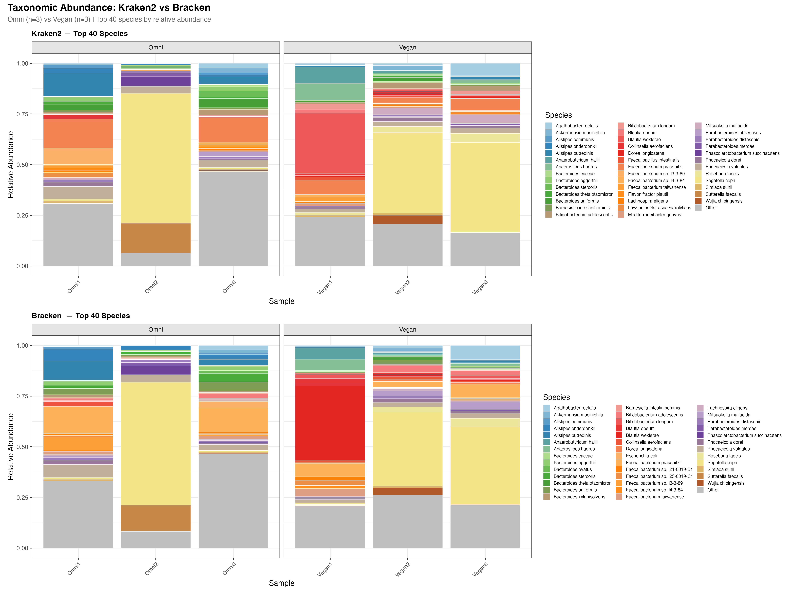
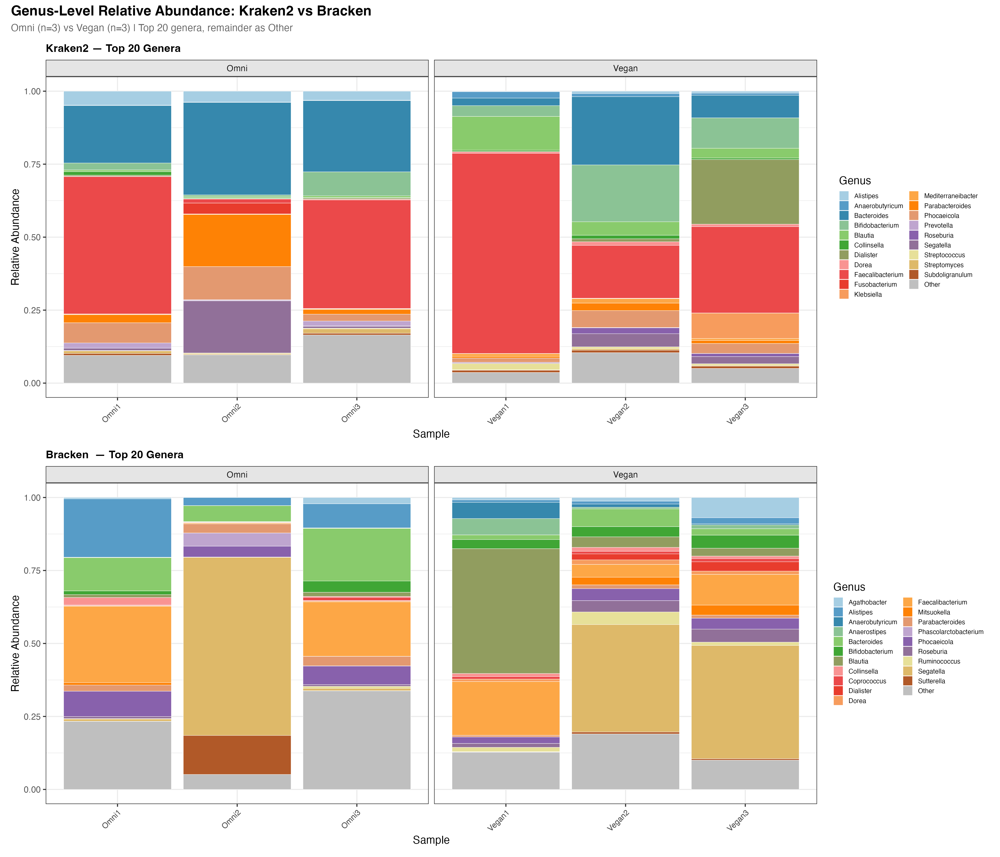
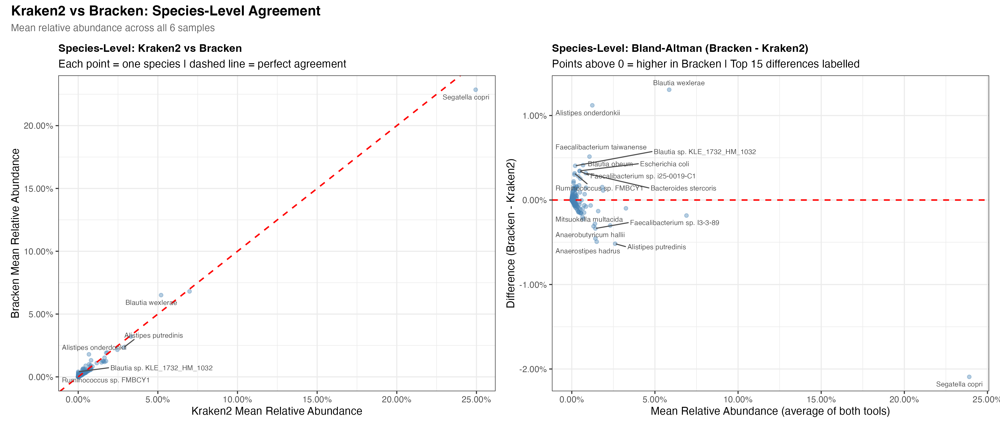
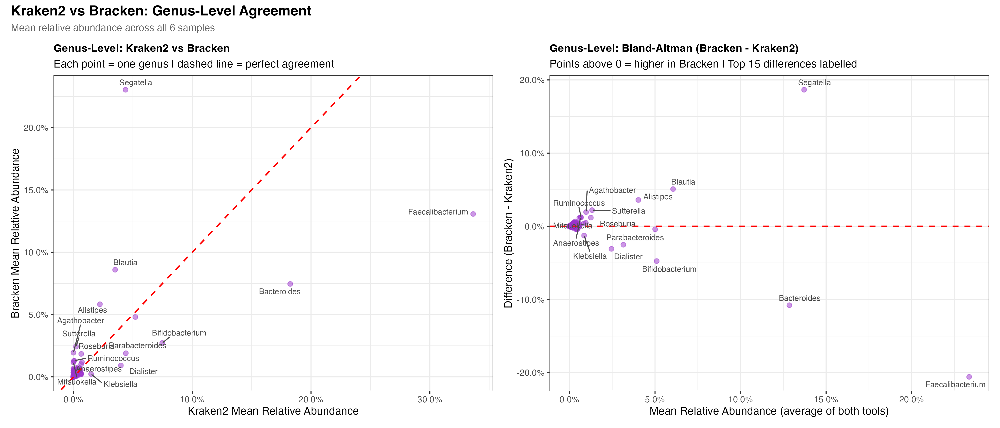
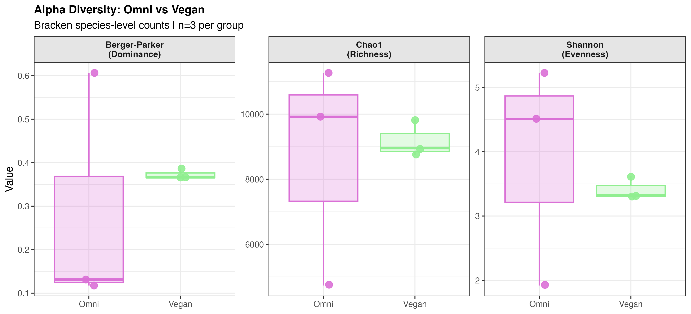
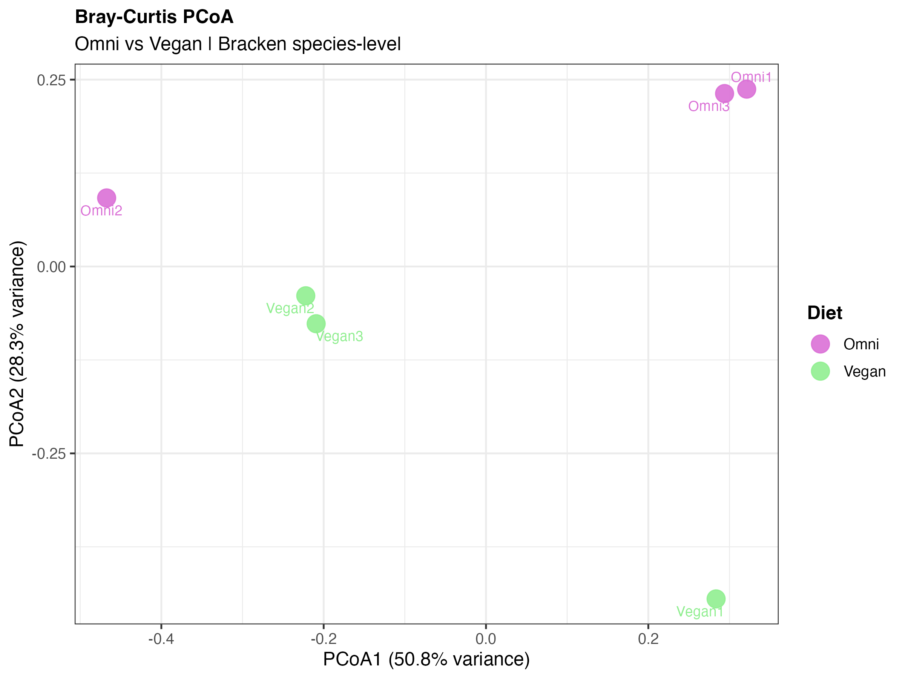
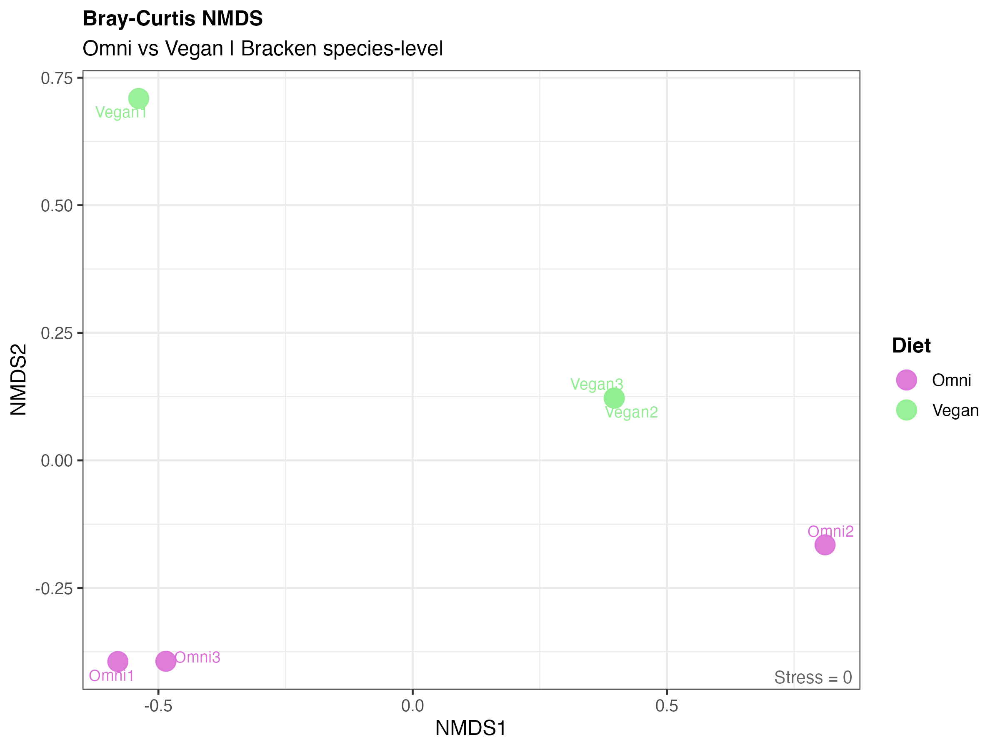
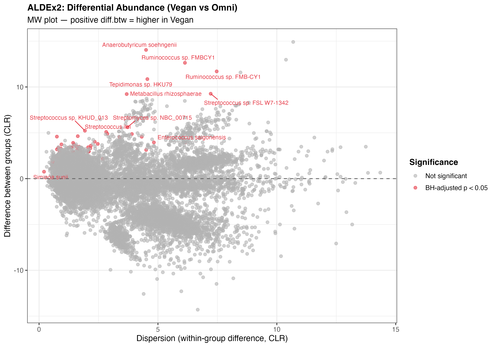
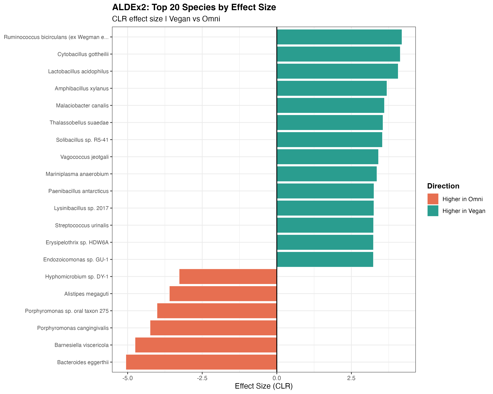

# Assignment 3: Taxonomic Classification of Shotgun Metagenomic Data
### Vegan vs. Omnivore Gut Microbiome Analysis

---

## Repository Structure

```
assignment3-metagenomics/
│
├── README.md                          
│
├── code/
│   ├── 01_download_and_process.sh     # SRA download, Trimmomatic QC, Kraken2
│   ├── 02_bracken.sh                  # Bracken abundance re-estimation
│   └── 03_analysis.R                  # R analysis: diversity + differential abundance
│
├── data/
│   ├── metadata.csv                   # Sample metadata (SampleID, Diet, SRX, SRR)
│   ├── *.kraken.report                # Kraken2 report files (6 samples)
│   ├── *.bracken                      # Bracken output files (6 samples)
│   └── *.bracken.report               # Bracken-corrected Kraken reports
│
├── results/
│   ├── A1_abundance_barplot.png       # Species-level relative abundance
│   ├── A2_genus_abundance_barplot.png # Genus-level relative abundance
│   ├── A3a_species_kraken_vs_bracken.png  # Species-level tool comparison
│   ├── A3b_genus_kraken_vs_bracken.png    # Genus-level tool comparison
│   ├── B_alpha_diversity.png          # Alpha diversity (Chao1, Shannon, Berger-Parker)
│   ├── C1_beta_diversity_pcoa.png     # Bray-Curtis PCoA
│   ├── C2_beta_diversity_nmds.png     # Bray-Curtis NMDS
│   ├── C_permanova_results.csv        # PERMANOVA statistics
│   ├── D_aldex2_MW_plot.png           # ALDEx2 MW plot
│   ├── D_aldex2_effect_size.png       # ALDEx2 effect size bar chart
│   └── D_aldex2_results.csv           # Full ALDEx2 results table
│
└── figures/                           # Figures embedded in this README
```

---

## Table of Contents
1. [Introduction](#1-introduction)
2. [Methods](#2-methods)
3. [Results](#3-results)
4. [Discussion](#4-discussion)
5. [References](#5-references)
 
---

## 1. Introduction
The human gut microbiome is a complex and dynamic community of microorganisms that plays a fundamental role in host metabolism, immune function, and overall health (1). Comprising trillions of bacteria, archaea, fungi, and viruses, the gut microbiome performs essential functions including the fermentation of dietary fibre into short-chain fatty acids, synthesis of vitamins, and modulation of the immune system (2). Diet is one of the most significant and modifiable drivers of gut microbiome composition, with long-term dietary patterns shown to consistently shape microbial community structure and function (3). Plant-based diets such as veganism have gained considerable attention for their associations with favourable metabolic and health outcomes, yet the microbial mechanisms underlying these effects remain incompletely understood(3).

The data analysed in this study were derived from De Filippis et al. (2019), who sequenced the gut metagenomes of 97 healthy Italian adults following omnivore, vegetarian, or vegan dietary patterns using Illumina NextSeq 500 paired-end 150 bp sequencing (4). The primary aim of that study was to investigate strain-level diversity of *Prevotella copri* across dietary groups. Their findings demonstrated that fibre-rich vegan and vegetarian diets selected for *P. copri* strains with enhanced potential for carbohydrate catabolism, while omnivore-associated strains showed a higher prevalence of the *leuB* gene involved in branched-chain amino acid biosynthesis — a known risk factor for glucose intolerance and type 2 diabetes (4). A subset of six samples (three omnivores, three vegans) from this dataset were reanalysed here to characterise broader community-level taxonomic differences between dietary groups.

Raw sequencing reads were first subjected to quality control using Trimmomatic (10), a widely used adapter trimming and quality filtering tool for Illumina data. Trimmomatic removes adapter sequences introduced during library preparation, trims low-quality bases from read ends, and discards reads that fall below a minimum length threshold. These steps are critical for ensuring that downstream taxonomic classification is not confounded by sequencing artifacts or poor-quality data. Taxonomic classification of trimmed reads was then performed using Kraken2, a k-mer based classifier that assigns sequencing reads to taxa by exact matching against a reference database (5). Kraken2 is computationally efficient and highly accurate; however, it can underestimate species-level abundances because reads are often assigned to higher taxonomic ranks when exact k-mer matches are not found. Bracken (Bayesian Reestimation of Abundance with KrakEN) addresses this limitation by probabilistically redistributing reads to the species level using a pre-built k-mer distribution model, and is recommended as the companion tool for accurate abundance estimation from Kraken2 output (6). Classification was performed against the k2_standard_20251015 database, which comprises RefSeq complete genomes for bacteria, archaea, viruses, and plasmids, along with the human reference genome (GRCh38) and UniVec_Core. This comprehensive database was selected as it provides broad taxonomic coverage appropriate for human gut metagenomics, and the included human genome allows host reads to be distinguished and excluded from microbial classification. The Bracken distribution file `database150mers.kmer_distrib` was used, which is specifically built for read lengths of 150 bp (the read length of the Illumina NextSeq 500 platform) and is required for accurate probabilistic re-assignment of reads to the species level. Alternative classifiers such as MetaPhlAn4 use a clade-specific marker gene approach rather than whole-genome k-mer matching, offering a smaller database footprint and potentially lower false positive rates, but with reduced sensitivity for novel or divergent organisms not represented in the marker gene database (7).

Community diversity was assessed using both alpha and beta diversity frameworks. Alpha diversity - the diversity within a single sample - was quantified using Chao1 to estimate species richness, Shannon entropy to capture both richness and evenness, and the Berger-Parker index as a measure of dominance (8). Beta diversity - the diversity between samples — was quantified using Bray-Curtis dissimilarity, which accounts for taxon abundance rather than presence/absence alone, and visualised using Principal Coordinates Analysis (PCoA) and Non-metric Multidimensional Scaling (NMDS) (8). Differential abundance between dietary groups was assessed using ALDEx2, which employs Monte Carlo Dirichlet sampling to model the technical and compositional uncertainty inherent to microbiome count data (9). Microbiome count data are compositional in nature, the observed counts of any taxon are relative to the total sequencing depth not absolute, which violates the assumptions of tools originally developed for RNA-seq differential expression analysis such as DESeq2 and edgeR. When applied to microbiome data, these tools have been shown to produce inflated false positive rates due to their failure to account for compositionality (9). ALDEx2 explicitly models this compositional structure using centred log-ratio (CLR) transformations and is therefore more appropriate for microbiome differential abundance analysis. While ALDEx2 is considered conservative, meaning it may miss some true differences, this is preferable to the high false positive rates introduced by differential expression tools, particularly given the small sample size in this study.

---

## 2. Methods

### 2.1 Data Acquisition

Raw sequencing data were obtained from the NCBI Sequence Read Archive (SRA) using the `prefetch` and `fastq-dump` utilities from the SRA Toolkit. Six samples were downloaded corresponding to three omnivore and three vegan individuals from De Filippis et al. (2019) (4):

| Sample ID | Diet  | SRX Accession | SRR Accession |
|-----------|-------|---------------|---------------|
| Omni1     | Omni  | SRX4967499    | SRR8146935    |
| Omni2     | Omni  | SRX4967498    | SRR8146936    |
| Omni3     | Omni  | SRX4967496    | SRR8146938    |
| Vegan1    | Vegan | SRX4967483    | SRR8146951    |
| Vegan2    | Vegan | SRX4967482    | SRR8146952    |
| Vegan3    | Vegan | SRX4967480    | SRR8146954    |

Samples were sequenced on the Illumina NextSeq 500 platform using paired-end 150 bp reads.

### 2.2 Quality Control

Adapter sequences and low-quality bases were removed using Trimmomatic v0.36 (10) in paired-end mode. The trimming process utilized the `TruSeq3-PE-2.fa` adapter file with a seed mismatch threshold of 2, palindrome clip threshold of 30, and simple clip threshold of 10; leading and trailing bases with quality below 3 were removed `LEADING:3, TRAILING:3`; a sliding window of 4 bases with a required average quality of 15 was applied `SLIDINGWINDOW:4:15`; and reads shorter than 50 bases after trimming were discarded `MINLEN:50`. Trimmed paired reads were retained for alignment; unpaired reads were discarded.

### 2.3 Taxonomic Classification

Trimmed paired-end reads were classified using Kraken2 (5) against the k2_standard_20251015 database (built October 15, 2025) with `--paired` and `--use-names` flags. Per-sample report files were generated using the `--report` flag.

### 2.4 Abundance Re-estimation with Bracken

Species-level abundance re-estimation was performed using Bracken v2.9 (6) with the following parameters: read length `-r 150`, taxonomic level `-l S` (species). The `database150mers.kmer_distrib` distribution file was used. All six samples were processed in a bash loop. Bracken was installed via conda in an `osx-64` environment on macOS (Apple M4) using `CONDA_SUBDIR=osx-64` to ensure bioconda binary compatibility.

### 2.5 R Analysis Environment

All downstream analyses were performed in R (v4.5.1) using RStudio. Key packages: **phyloseq** (Bioconductor) for microbiome data management and diversity analysis; **ALDEx2** (Bioconductor) for differential abundance; **vegan** (CRAN) for PERMANOVA; **tidyverse**, **ggplot2**, **patchwork**, **ggrepel**, and **RColorBrewer** (CRAN) for data manipulation and visualisation. Namespace conflicts were resolved using the `conflicted` package, prioritising `dplyr::select`, `dplyr::filter`, `dplyr::rename`, `dplyr::mutate`, and `purrr::reduce`.

### 2.6 Data Import and Filtering

Bracken and Kraken2 species-level output files were loaded into R and merged into count matrices using base R `merge()`. Taxa with fewer than 10 total reads across all samples were removed using `prune_taxa()`. Note: this filtering step removes singletons prior to Chao1 estimation, which may cause Chao1 to underestimate true species richness. Separate **phyloseq** objects were constructed for Kraken2 and Bracken outputs.

### 2.7 Alpha Diversity

Three metrics were calculated on Bracken species-level counts: Chao1 and Shannon via `estimate_richness()` in **phyloseq**; Berger-Parker dominance calculated as max(species reads) / total reads per sample. Statistical differences were assessed using the Wilcoxon rank-sum test (treated as exploratory given n=3 per group).

### 2.8 Beta Diversity

Bray-Curtis dissimilarity was calculated on relative abundance-transformed Bracken data using `phyloseq::distance()`. Community composition was visualised using PCoA (`ordinate(method = "PCoA")`) and NMDS (`ordinate(method = "NMDS")`; `set.seed(42)`). PERMANOVA was performed using `adonis2()` from the **vegan** package (11) with 999 permutations.

### 2.9 Differential Abundance

**ALDEx2** (9) was run on raw integer Bracken species counts with 128 Monte Carlo Dirichlet instances (`mc.samples = 128`), Welch's t-test and Wilcoxon rank-sum test (`test = "t"`), effect size estimation (`effect = TRUE`), and inter-quartile log-ratio denominator (`denom = "iqlr"`). A random seed of 42 was set for reproducibility. Results were ranked by Benjamini-Hochberg adjusted Wilcoxon p-value.

---

## 3. Results

### 3.1 Taxonomic Abundance

Species- and genus-level relative abundance was examined across all six samples using both Kraken2 and Bracken outputs (Figures 1 and 2). The top 40 species and top 20 genera by mean relative abundance are displayed, with all remaining taxa collapsed into an "Other" category (grey).


**Figure 1.** Stacked bar plots of species-level relative abundance for Kraken2 (top panel) and Bracken (bottom panel) across omnivore (Omni1–3) and vegan (Vegan1–3) samples. Each colour represents one of the top 40 species ranked by mean relative abundance across all six samples; all remaining species are pooled as "Other" (grey). Samples are grouped by diet and bars sum to 1.0.

Both tools identified *Segatella copri* (formerly *Prevotella copri*), *Bacteroides* spp., *Faecalibacterium* spp., *Phocaeicola* spp., and *Alistipes* spp. as dominant taxa across samples. Vegan samples showed a markedly higher relative abundance of *Segatella copri* compared to omnivore samples, consistent with previous findings linking *Prevotella/Segatella* with plant-rich diets (4). Omnivore samples showed greater inter-sample variability, with Omni2 notably enriched in *Faecalibacterium prausnitzii* and *Blautia* spp.


**Figure 2.** Stacked bar plots of genus-level relative abundance for Kraken2 (top panel) and Bracken (bottom panel) across all six samples. Each colour represents one of the top 20 genera ranked by mean relative abundance; all remaining genera are pooled as "Other" (grey). Bracken genus-level abundances were derived by aggregating species-level counts by the first word of the species name.

At the genus level, *Bacteroides*, *Faecalibacterium*, *Segatella*, *Phocaeicola*, and *Alistipes* were consistently among the most abundant genera across both tools. Some differences were observed in the minor genera detected. For example, Kraken2 identified *Streptomyces* and *Fusobacterium* among the top 20 genera, while Bracken detected *Coprococcus* and *Ruminococcus*, thus reflecting differences in how the two tools assign reads at higher taxonomic levels.

#### Kraken2 vs. Bracken Comparison

Tool agreement was assessed at both species and genus level using scatter plots and Bland-Altman method comparison plots (Figures 3 and 4).


**Figure 3.** Comparison of species-level mean relative abundances between Kraken2 and Bracken across all six samples. Left panel: scatter plot in which each point represents one species; the dashed red line indicates perfect agreement (slope = 1, intercept = 0). The 15 species with the greatest absolute difference between tools are labelled. Right panel: Bland-Altman plot showing the difference (Bracken − Kraken2) plotted against the mean relative abundance of both tools; points above zero indicate higher estimates in Bracken.


**Figure 4.** Comparison of genus-level mean relative abundances between Kraken2 and Bracken across all 6 samples. Left panel: scatter plot in which each point represents one genus; the dashed red line indicates perfect agreement (slope = 1, intercept = 0). The 15 genera with the greatest absolute difference between tools are labelled. Right panel: Bland-Altman plot of the difference (Bracken − Kraken2) against mean relative abundance of both tools; points above zero indicate higher estimates in Bracken.

At the species level, the two tools showed strong overall agreement for the most abundant taxa, with points clustering near the line of perfect agreement. The largest discordances were observed for *Segatella copri*, *Alistipes onderdonkii*, and *Blautia wexlerae*, where Kraken2 tended to assign higher relative abundances than Bracken. At the genus level, *Faecalibacterium*, *Segatella*, and *Bacteroides* showed the greatest absolute differences, with Kraken2 consistently estimating higher relative abundances. These patterns reflect Bracken's probabilistic redistribution of reads that Kraken2 assigns to higher taxonomic ranks, resulting in more conservative but statistically principled species-level estimates.

---

### 3.2 Alpha Diversity

Alpha diversity was assessed using three complementary metrics: Chao1 (richness), Shannon entropy (evenness), and the Berger-Parker dominance index (Figure 5).


**Figure 5.** Alpha diversity metrics for omnivore (pink, n=3) and vegan (green, n=3) samples calculated from Bracken species-level counts. Each point represents one sample. Left panel: Berger-Parker dominance index (max species proportion / total reads), where higher values indicate greater dominance by a single taxon. Centre panel: Shannon entropy (H'), capturing both richness and evenness. Right panel: Chao1 species richness estimator. Note: taxa with fewer than 10 reads were removed prior to analysis, which may lead to underestimation of Chao1.

Vegan samples showed a trend towards higher Chao1 richness and Shannon evenness compared to omnivore samples. The Berger-Parker dominance index was also higher in vegan samples, driven by the high relative abundance of *Segatella copri* in that group. No statistically significant differences were detected between groups by Wilcoxon rank-sum test for any of the three measures; given the small sample size (n=3 per group), these results are treated as exploratory.

---

### 3.3 Beta Diversity

Beta diversity was quantified using Bray-Curtis dissimilarity and visualised using PCoA (Figure 6) and NMDS (Figure 7).


**Figure 6.** Principal Coordinates Analysis (PCoA) of Bray-Curtis dissimilarities calculated from Bracken species-level relative abundances. PCoA1 explains 50.8% of the total variance and PCoA2 explains 28.3%, together capturing 79.1% of variance in two dimensions. Each point represents one sample, coloured by diet group (pink = Omnivore, green = Vegan). Labels indicate individual sample IDs.


**Figure 7.** Non-metric Multidimensional Scaling (NMDS) ordination of Bray-Curtis dissimilarities from Bracken species-level relative abundances. NMDS stress = 0, indicating a perfect two-dimensional representation of the pairwise dissimilarity structure for this six-sample dataset. Each point represents one sample, coloured by diet group pink = Omnivore, green = Vegan). Labels indicate individual sample IDs.

Both PCoA and NMDS showed a partial separation between omnivore and vegan samples. Vegan2 and Vegan3 clustered tightly together, while Omni2 was positioned separately from the other omnivore samples in both ordinations, consistent with its distinct species profile observed in the abundance plots. PERMANOVA revealed that diet group explained 23.2% of the total variation in microbial community composition (F = 1.206, R² = 0.232, p = 0.200; Table 1). The result did not reach statistical significance, most likely due to the limited power afforded by n=3 per group; however, the R² effect size is biologically meaningful and comparable to values reported in larger diet-microbiome studies (3).

| Source   | Df | SumOfSqs | R²    | F     | p-value |
|----------|----|----------|-------|-------|---------|
| Diet     | 1  | 0.265    | 0.232 | 1.206 | 0.200   |
| Residual | 4  | 0.879    | 0.768 | —     | —       |
| Total    | 5  | 1.144    | 1.000 | —     | —       |

**Table 1.** PERMANOVA results for Bray-Curtis dissimilarity by diet group (999 permutations). R² indicates the proportion of total community variance explained by diet.

---

### 3.4 Differential Abundance

Differential abundance between omnivore and vegan samples was assessed using **ALDEx2** with 128 Monte Carlo Dirichlet instances and the inter-quartile log-ratio (iqlr) denominator. Results are shown in the MW plot (Figure 8) and effect size bar chart (Figure 9).


**Figure 8.** ALDEx2 MW (median within vs. median between) plot for differential abundance analysis comparing vegan and omnivore gut microbiomes. Each point represents one species. The x-axis shows within-group CLR dispersion; the y-axis shows the between-group CLR difference, where positive values indicate higher abundance in vegan samples and negative values indicate higher abundance in omnivore samples. Red points indicate species with BH-adjusted Wilcoxon p < 0.05 (wi.eBH); grey points are not significant. Significant species are labelled.


**Figure 9.** Horizontal bar chart of the top 20 species ranked by absolute ALDEx2 CLR effect size comparing vegan vs. omnivore samples. Green bars indicate species with higher relative abundance in vegan samples; orange bars indicate higher relative abundance in omnivore samples. Effect sizes are derived from 128 Monte Carlo CLR-transformed instances per sample.

ALDEx2 identified 11 species with BH-adjusted Wilcoxon p < 0.05, including *Anaerobutyricum soehngenii*, *Ruminococcus* sp. FMB-CY1, *Simiaoa sunii*, and several *Streptococcus* species. Among the species with the largest effect sizes, *Bacteroides eggerthii* and *Barnesiella viscericola* showed the strongest enrichment in omnivore samples, while *Ruminococcus bicirculans* and *Lactobacillus acidophilus* showed higher effect sizes in vegan samples. Several significantly differentially abundant species (e.g. *Porphyromonas cangingivalis*, *Streptococcus urinalis*, *Lysinibacillus* sp.) are not typical gut commensals, which likely reflects database-level misclassification or contamination in a small number of reads and should be interpreted with caution.

---

## 4. Discussion

This study performed a comparative taxonomic analysis of gut metagenomes from three omnivore and three vegan individuals, using Kraken2 and Bracken for classification and a suite of diversity and differential abundance methods implemented in R. While the small sample size limits statistical power, several biologically meaningful patterns were observed that are consistent with the broader literature on diet and the gut microbiome.

The most striking taxonomic difference between dietary groups was the high relative abundance of *Segatella copri* (formerly classified as *Prevotella copri*) in vegan samples. This finding directly recapitulates the results of De Filippis et al. (2019), who observed that fibre-rich diets select for *P. copri* strains with enhanced carbohydrate catabolism potential (4). *Segatella/Prevotella* has been consistently associated with plant-rich diets across multiple cohorts and is thought to contribute to fibre fermentation and short-chain fatty acid production (12). The genus *Faecalibacterium*, and particularly *Faecalibacterium prausnitzii*, was also prominently detected across both groups. *F. prausnitzii* is a major butyrate producer with well-established anti-inflammatory properties; its abundance is reduced in inflammatory bowel disease and is considered a marker of gut health (13). Its presence across both dietary groups suggests it is a core member of the healthy gut microbiome regardless of diet.

At the genus level, *Bacteroides* was among the most abundant genera in omnivore samples, consistent with the well-established "Bacteroides enterotype" typically associated with high-fat, high-protein Western diets (14). In contrast, vegan samples showed greater relative abundance of *Segatella*, *Bifidobacterium*, and *Roseburia* which are associated with fermentation of plant polysaccharides and production of beneficial metabolites including butyrate and acetate. *Bifidobacterium adolescentis* and *Bifidobacterium longum*, observed predominantly in vegan samples, are known to metabolise dietary fibres and prebiotics and have been linked to beneficial metabolic effects (15).

Beta diversity analysis showed a partial separation between dietary groups, with vegan samples clustering more tightly than omnivore samples in both PCoA and NMDS ordinations. This greater within-group homogeneity among vegans may reflect a more constrained dietary niche. The consistent exclusion of animal products may reduce the diversity of environmental microbial exposures, producing a more uniform community structure. Although PERMANOVA did not reach statistical significance (R² = 0.232, p = 0.200), the effect size is comparable to that reported in larger diet-microbiome studies, where diet consistently explains 5–25% of community variance (3). The non-significant p-value is attributable to the small sample size (n=3 per group) rather than an absence of biological effect.

Differential abundance analysis with **ALDEx2** identified *Anaerobutyricum soehngenii* as significantly more abundant in vegan samples. This species is a propionate and butyrate producer previously associated with plant fibre metabolism and enriched in individuals consuming high-fibre diets (4). The enrichment of *Ruminococcus* spp. in vegan samples is similarly consistent with the literature, as *Ruminococcus* species are key degraders of complex plant polysaccharides including resistant starch and cellulose (15). Several differentially abundant species, including oral taxa such as *Porphyromonas cangingivalis* and environmental organisms such as *Hyphomicrobium* sp., are not typical gut commensals and likely represent low-level contamination or database misclassification, a known limitation of k-mer based classifiers applied against large reference databases containing environmental and clinical genomes (5).

This analysis is limited by the small sample size (n=3 per group), which substantially reduces statistical power for all tests. The filtering of low-abundance taxa prior to analysis may have led to underestimation of Chao1 species richness. Future work should incorporate larger cohorts, longitudinal sampling, and functional metagenomics to better characterise the metabolic implications of the observed taxonomic differences.

---

## 5. References

1. Clemente JC, Ursell LK, Parfrey LW, Knight R. The impact of the gut microbiota on human health: an integrative view. Cell. 2012;148(6):1258–70. doi: [10.1016/j.cell.2012.01.035](https://doi.org/10.1016/j.cell.2012.01.035)

2. Sonnenburg JL, Bäckhed F. Diet–microbiota interactions as moderators of human metabolism. Nature. 2016;535(7610):56–64. doi: [10.1038/nature18846](https://doi.org/10.1038/nature18846)

3. Fackelmann G, Wosniok W, Marques CG, Boer JMA, O'Donovan CM, Clarke G, et al. Gut microbiome signatures of vegan, vegetarian and omnivore diets and associated health outcomes across 21,561 individuals. Nat Microbiol. 2025;10:40–52. doi: [10.1038/s41564-024-01870-z](https://doi.org/10.1038/s41564-024-01870-z)

4. De Filippis F, Pasolli E, Tett A, Tarallo S, Naccarati A, De Angelis M, et al. Distinct genetic and functional traits of human intestinal Prevotella copri strains are associated with different habitual diets. Cell Host Microbe. 2019;25(3):444–453.e3. doi: [10.1016/j.chom.2019.01.004](https://doi.org/10.1016/j.chom.2019.01.004)

5. Wood DE, Lu J, Langmead B. Improved metagenomic analysis with Kraken 2. Genome Biol. 2019;20(1):257. doi: [10.1186/s13059-019-1891-0](https://doi.org/10.1186/s13059-019-1891-0)

6. Lu J, Breitwieser FP, Thielen P, Salzberg SL. Bracken: estimating species abundance in metagenomics data. PeerJ Comput Sci. 2017;3:e104. doi: [10.7717/peerj-cs.104](https://doi.org/10.7717/peerj-cs.104)

7. Blanco-Míguez A, Beghini F, Cumbo F, McIver LJ, Thompson KN, Zolfo M, et al. Extending and improving metagenomic taxonomic profiling with uncharacterized species using MetaPhlAn 4. Nat Biotechnol. 2023;41(11):1633–44. doi: [10.1038/s41587-023-01688-w](https://doi.org/10.1038/s41587-023-01688-w)

8. Whittaker RH. Evolution and measurement of species diversity. Taxon. 1972;21(2/3):213–51. doi: [10.2307/1218190](https://doi.org/10.2307/1218190)

9. Fernandes AD, Reid JN, Macklaim JM, McMurrough TA, Edgell DR, Gloor GB. Unifying the analysis of high-throughput sequencing datasets: characterizing RNA-seq, 16S rRNA gene sequencing and selective growth experiments by compositional data analysis. Microbiome. 2014;2:15. doi: [10.1186/2049-2618-2-15](https://doi.org/10.1186/2049-2618-2-15)

10. Bolger AM, Lohse M, Usadel B. Trimmomatic: a flexible trimmer for Illumina sequence data. Bioinformatics. 2014;30(15):2114–20. doi: [10.1093/bioinformatics/btu170](https://doi.org/10.1093/bioinformatics/btu170)

11. Oksanen J, Blanchet FG, Friendly M, Kindt R, Legendre P, McGlinn D, et al. vegan: Community Ecology Package. R package version 2.6-4. 2022. Available from: [https://CRAN.R-project.org/package=vegan](https://CRAN.R-project.org/package=vegan)

12. Kovatcheva-Datchary P, Nilsson A, Akrami R, Lee YS, De Vadder F, Arora T, et al. Dietary fiber-induced improvement in glucose metabolism is associated with increased abundance of Prevotella. Cell Metab. 2015;22(6):971–82. doi: [10.1016/j.cmet.2015.10.001](https://doi.org/10.1016/j.cmet.2015.10.001)

13. Sokol H, Pigneur B, Watterlot L, Lakhdari O, Bermúdez-Humarán LG, Gratadoux JJ, et al. Faecalibacterium prausnitzii is an anti-inflammatory commensal bacterium identified by gut microbiota analysis of Crohn disease patients. Proc Natl Acad Sci USA. 2008;105(43):16731–6. doi: [10.1073/pnas.0804812105](https://doi.org/10.1073/pnas.0804812105)

14. Arumugam M, Raes J, Pelletier E, Le Paslier D, Yamada T, Mende DR, et al. Enterotypes of the human gut microbiome. Nature. 2011;473(7346):174–80. doi: [10.1038/nature09944](https://doi.org/10.1038/nature09944)

15. Flint HJ, Scott KP, Duncan SH, Louis P, Forano E. Microbial degradation of complex carbohydrates in the gut. Gut Microbes. 2012;3(4):289–306. doi: [10.4161/gmic.19897](https://doi.org/10.4161/gmic.19897)
